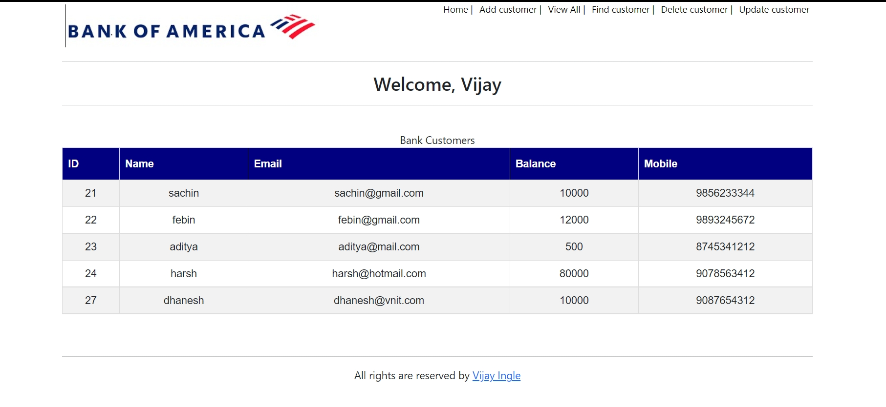
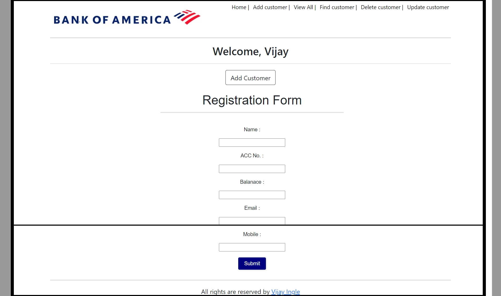
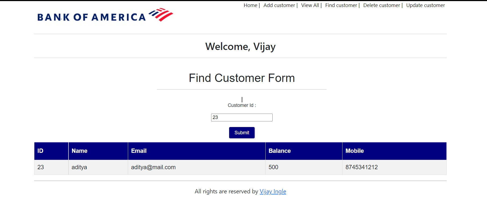
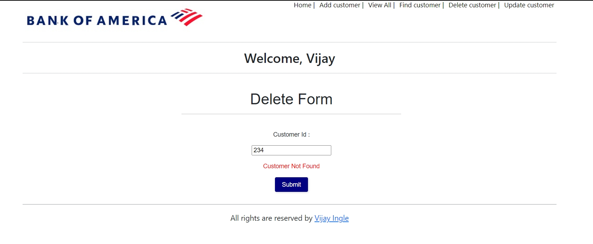

# CRUD APP
For customers of bank (eg Bank of America)
## Technologies used
1. Java Version : 8
2. React.js
3. Spring
4. Oracle 11 g

## About project

This project Implements the 
1. Add Customer
2. View All Customers
3. Delete Customer 
4. Modify customer
5. Find Customer By Id

## Installation And Setup
1. Oracle 11g
2. Spring
3. IDE Eclipse


Table Structure
```
.png)
```

## How to run ?
- Clone the repo
- [Spring] Open this in IDE ( eq Eclipse )
1. install dependencies by Maven
2. Check Application.Properties modify the properties according to your sysytem

- [React] 
1. run npm install
2. npm start

## Demo images
- Home


- View All customer


- Add Customer


- Find By Id 
1. when id is present in database


- Delete Customer
1. when id not prsent




## Authors and acknowledgmenth
 Vijay ingle
